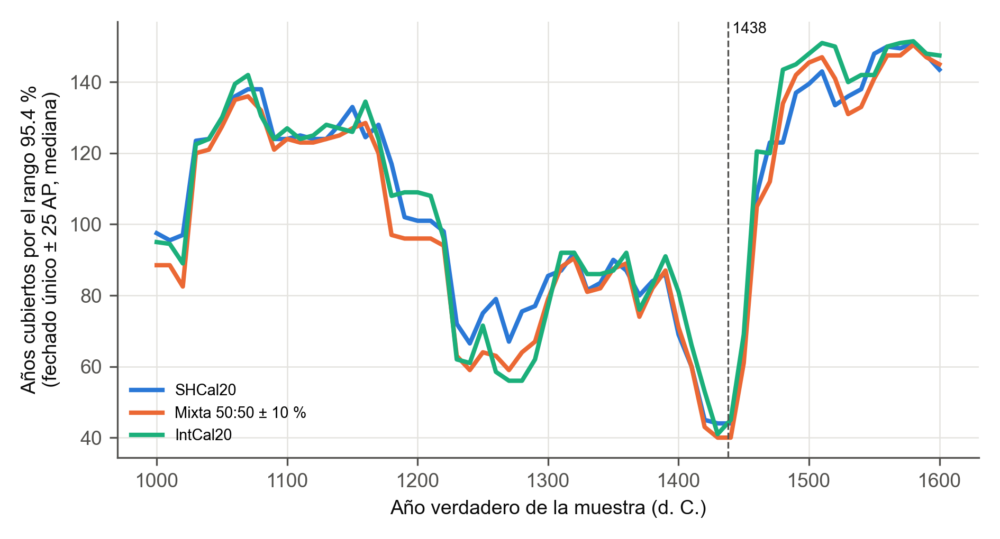
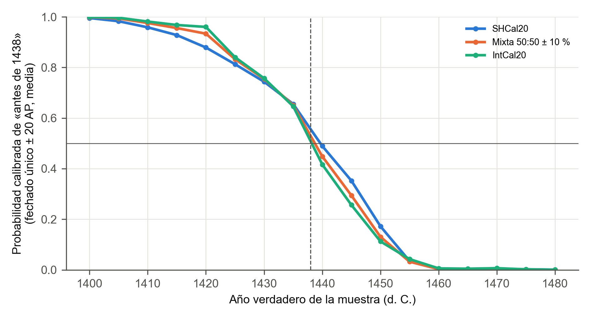
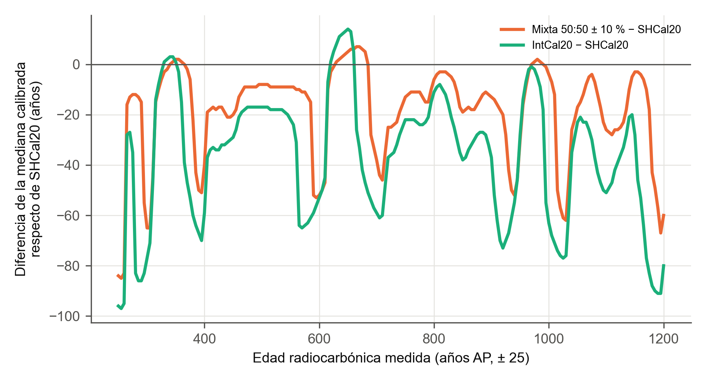
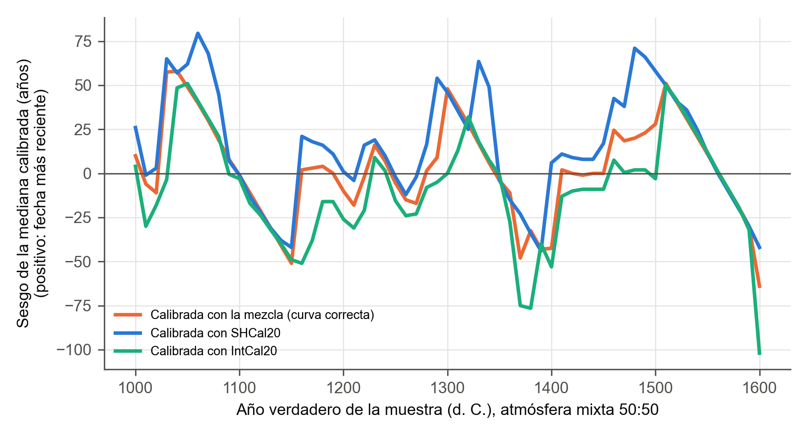

# Simulación de fechados para la cronología del Cusco

## Diseño

Para cada año verdadero se simuló la edad que mediría un laboratorio: el
valor de la curva en ese año, más la dispersión de la curva y el error del
laboratorio. Esa edad se calibró y se comparó con el año de partida. Cada
punto resume 200 simulaciones con semilla fija, así que el resultado se
repite al volver a ejecutar el estudio. Se usaron las tres curvas en debate:
SHCal20, IntCal20 y una mezcla 50 % ± 10 %. En cada caso la muestra se
simuló y se calibró con la misma curva.

El año 1438 es la referencia de la cronología documental: las fuentes
escritas lo asocian al ascenso de Pachacuti (Burger et al., 2021).

## 1. El ancho del rango depende del siglo

Fechado único ± 25 AP; mediana de los años que cubre el rango 95.4 %.

| Año verdadero (d. C.) | SHCal20 | Mixta 50:50 | IntCal20 |
|---|---:|---:|---:|
| 1000–1199 | 124 | 123 | 125 |
| 1200–1399 | 84 | 82 | 85 |
| 1400–1449 | 45 | 43 | 53 |
| 1450–1539 | 134 | 134 | 144 |
| 1540–1599 | 149 | 147 | 149 |

La primera mitad del siglo XV es la ventana más precisa del milenio: allí la
curva desciende con fuerza y un fechado único queda acotado a unos 45 años.
Desde 1450 la curva se aplana y ondula; un fechado del apogeo inka o de la
llegada española abarca de 130 a 150 años y suele partirse en dos tramos.
Para separar la ocupación inka tardía de la colonial temprana no alcanza un
fechado aislado: hacen falta secuencias estratigráficas y modelos
bayesianos.

La cobertura observada del rango 95.4 % varió entre 86.5 % y 100 % según el año
(mediana 95.5 %) en estas simulaciones de 200 muestras por punto. La
cobertura no es idéntica para cada año verdadero.

## 2. ¿Antes o después de 1438?

Fechado único ± 20 AP; probabilidad media, tras calibrar, de que la muestra
sea anterior a 1438.

| Año verdadero | SHCal20 | Mixta 50:50 | IntCal20 |
|---|---:|---:|---:|
| 1420 | 0.88 | 0.93 | 0.96 |
| 1430 | 0.74 | 0.75 | 0.76 |
| 1435 | 0.66 | 0.65 | 0.65 |
| 1440 | 0.49 | 0.45 | 0.42 |
| 1445 | 0.35 | 0.29 | 0.26 |
| 1450 | 0.17 | 0.13 | 0.11 |
| 1455 | 0.04 | 0.03 | 0.04 |

Un fechado de una muestra de 1430 deja todavía una probabilidad de un cuarto
de caer después de 1438. Solo las muestras de 1420 o antes, y de 1455 o
después, se asignan con claridad a uno u otro lado. Discutir la fecha de
1438 con radiocarbono exige varios fechados: Ziółkowski et al. (2021) los
combinaron en un modelo de secuencia y Burger et al. (2021) reunieron el
primer conjunto amplio de Machu Picchu.

## 3. La curva mueve la fecha

Edad medida ± 25 AP; diferencia entre la mediana calibrada con otra curva y
la obtenida con SHCal20 (negativo: la otra curva da una fecha más antigua).

| Tramo de edad | Mixta − SHCal20 | IntCal20 − SHCal20 |
|---|---|---|
| 250–1200 AP (todo) | mediana −13, de −85 a +7 | mediana −32, de −97 a +14 |
| 350–600 AP (Killke tardío a Inka) | mediana −10, de −53 a +2 | mediana −30, de −70 a +1 |

Para edades de la época inka, calibrar con IntCal20 envejece la fecha unos
30 años respecto de SHCal20, y hasta 70 en las mesetas. Esa diferencia
equivale a una generación o más, así que la curva usada debe declararse
junto con cada fecha. La mezcla 50:50 queda entre ambas.

## 4. Si la atmósfera fuera mixta y se calibrara con una sola curva

Se simularon muestras bajo una atmósfera mezclada a partes iguales y se
calibraron con la mezcla (curva correcta), con SHCal20 y con IntCal20.
Fechado único ± 25 AP, 1000–1600 d. C.

| Calibrada con | Sesgo mediano 1400–1530 | Cobertura 95.4 % mediana | Cobertura mínima 1400–1530 |
|---|---:|---:|---:|
| Mezcla (correcta) | +19 años | 95.5 % | 91.5 % |
| SHCal20 | +37 años | 92.5 % | 78.5 % |
| IntCal20 | −1 año | 90.0 % | 79.5 % |

Si el Cusco respondiera a una atmósfera mixta, calibrar con SHCal20
rejuvenecería las fechas del siglo XV: entre 1460 y 1500 la mediana sale de
40 a 70 años más reciente que el año verdadero, frente a 20–30 con la curva
correcta. En los peores años, el rango 95.4 % deja fuera el
año verdadero en uno de cada cinco fechados. La curva equivocada no solo
desplaza la fecha: vuelve engañosa la seguridad del rango.

La mediana tampoco es un buen resumen, ni siquiera con la curva correcta:
en las mesetas se desvía hasta 65 años del año verdadero. Una tesis
debe informar el rango 95.4 % completo, no la mediana sola.

## Limitaciones

- Se simula un solo fechado por evento; los modelos con varias muestras y
  estratigrafía reducen los rangos y serán la siguiente etapa.
- La proporción real de aire del norte sobre el Cusco no se conoce; el
  apartado 4 prueba una mezcla 50:50 como escenario, no como dato.
- Se supone material de vida corta y sin efecto reservorio.

## Archivos

| Archivo | Contenido |
|---|---|
| [`simulacion/recuperacion.csv`](simulacion/recuperacion.csv) | Cobertura, ancho, tramos y error por año y curva |
| [`simulacion/antes_1438.csv`](simulacion/antes_1438.csv) | Probabilidad de «antes de 1438» por año y curva |
| [`simulacion/efecto_curva.csv`](simulacion/efecto_curva.csv) | Medianas y rangos por edad con cada curva |

## Referencias

Burger, R. L., Salazar, L. C., Nesbitt, J., Washburn, E. y Fehren-Schmitz, L.
(2021). New AMS dates for Machu Picchu: Results and implications.
*Antiquity, 95*(383), 1265–1279. https://doi.org/10.15184/aqy.2021.99

Ziółkowski, M., Bastante Abuhadba, J. M., Hogg, A., Sieczkowska, D.,
Rakowski, A., Pawlyta, J. y Manning, S. W. (2021). When did the Incas build
Machu Picchu and its satellite sites? New approches [*sic*] based on
radiocarbon dating. *Radiocarbon, 63*(4), 1133–1148.
https://doi.org/10.1017/RDC.2020.79
