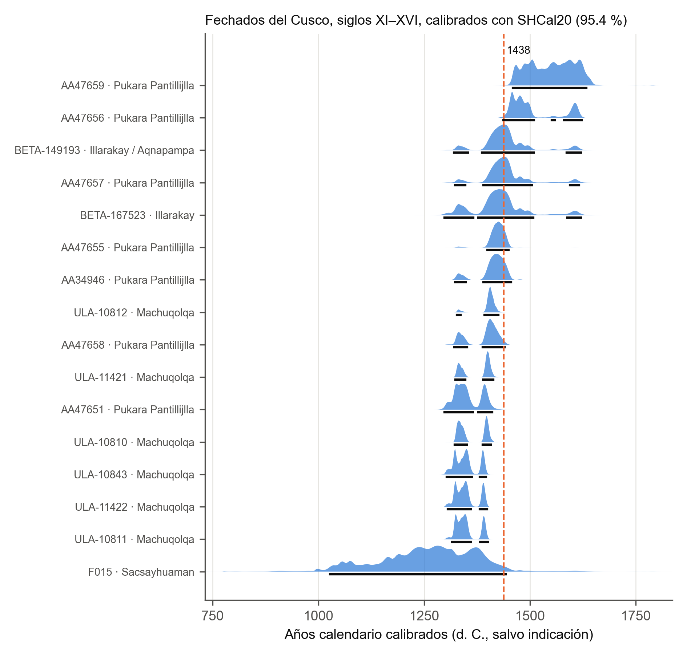
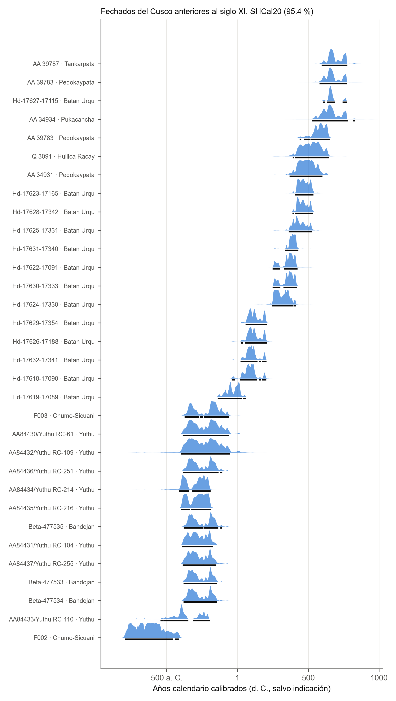

# Fechados radiocarbónicos del Cusco en la biblioteca del proyecto

## Corpus

La búsqueda recorrió los 12 547 archivos Markdown de `_BIBLIOTECA_MD`. De
ellos, 413 mencionan radiocarbono y 83 documentos tratan además del Cusco.
La extracción reunió 94 fechados del departamento del Cusco. Cada fila guarda
el archivo, la línea y la cita textual ([criterios y dudas](../02_datos/fechados/extraccion_informe.md)).

Por decisión del investigador se excluyeron las 16 filas tomadas de Earle
(2025) ([`excluidos.csv`](../02_datos/fechados/excluidos.csv)). Quedan 78.

| Ámbito | Fechados | Con edad AP ± σ | Solo rango o año |
|---|---:|---:|---:|
| Ciudad del Cusco | 11 | 1 | 10 |
| Valle del Cusco | 22 | 18 | 4 |
| Región Cusco | 45 | 38 | 7 |
| **Total** | **78** | **57** | **21** |

## Control de la extracción

- En 60 de los 73 fechados con edad y sigma, antes de la exclusión, la edad,
  la sigma y el código aparecen tal cual en las líneas citadas.
- En los 13 de Batán Urqu el OCR partió el código en dos líneas. Se revisó
  la tabla a mano y cada edad corresponde a su código.
- El código AA 39783 (Peqokaypata) figura con 1527 ± 40 AP en una fuente,
  que cita a Bauer (2008), y con 1422 ± 51 AP en otra, que cita a Bauer
  (2011). Se conservan ambas filas hasta revisar las publicaciones
  originales.

## La ciudad casi no tiene fechados utilizables

De los 11 fechados de la ciudad, solo uno trae edad y sigma: Sacsayhuaman,
770 ± 140 AP, obtenido por Edward Dwyer en la década de 1960 y citado de
segunda mano. Su rango al 95.4 % con SHCal20 abarca 416 años, de 1027 a
1442 d. C. Los fechados de Chanapata y Marcavalle solo aparecen como años
calendario, sin la edad convencional, y no se pueden recalibrar. Para
estudiar el casco urbano con radiocarbono hacen falta nuevos fechados, o las
publicaciones originales de los antiguos.

## Siglos XI a XVI: 16 fechados

| Sitio | Fechados | Probabilidad de «antes de 1438» (SHCal20) |
|---|---:|---|
| Machuqolqa (Chinchero–Maras) | 6 | 1.00 en los seis |
| Pukara Pantillijlla | 7 | de 0.00 a 1.00; tres entre 0.5 y 0.85 |
| Illarakay y Aqnapampa | 2 | 0.64 y 0.53 |
| Sacsayhuaman | 1 | 0.97 |

Los seis fechados de Machuqolqa (± 15 AP) son anteriores a 1438 con total
seguridad. En Pukara Pantillijlla, AA47651 y AA47658 caen antes, AA47656 y
AA47659 después, y AA47655, AA34946 y AA47657 quedan en la franja en que un
fechado aislado no decide. Esto coincide con la simulación: cerca de 1438 hace
falta un modelo de varios fechados ([simulación](03_simulacion_cusco.md)).

Con IntCal20, las medianas de estos 16 fechados salen 30 años más antiguas en
la mediana del grupo (de 62 años más antiguas a 22 más recientes).

## Fechados anteriores

Los fechados formativos de Yuthu, Bandojan y Chumo-Sicuani se sitúan entre
790 y 59 a. C. Los de Batán Urqu van del siglo II a. C. al VIII d. C.
Los de Peqokaypata, Tankarpata y Pukacancha, entre los siglos IV y IX d. C. Los
nueve fechados de la laguna Acopia son de sedimento y no tienen contexto
arqueológico: se calibran, pero no se grafican.

## Archivos

| Archivo | Contenido |
|---|---|
| [`fechados_cusco/calibrados.csv`](fechados_cusco/calibrados.csv) | 57 fechados: rango 95.4 % y mediana con las tres curvas, y diferencia IntCal20 − SHCal20 |
| [`../02_datos/fechados/fechados_biblioteca.csv`](../02_datos/fechados/fechados_biblioteca.csv) | 94 filas originales con fuente, línea y cita |
| [`../02_datos/fechados/excluidos.csv`](../02_datos/fechados/excluidos.csv) | Filas excluidas y su motivo |

## Limitaciones

- La biblioteca reúne sobre todo tesis de la UNSAAC que citan fechados de
  segunda mano. Antes de usar un fechado en una tesis, hay que verificarlo en
  la publicación original.
- El material fechado no siempre se declara. La calibración atmosférica
  supone material terrestre de vida corta.

## Referencia

Earle, J. E. (2025). Tombs as evidence of religious diversity in the Sacred
Valley, Peru (ca. AD 1000–1532). *Latin American Antiquity, 36*(3),
635–657. https://doi.org/10.1017/laq.2024.28
