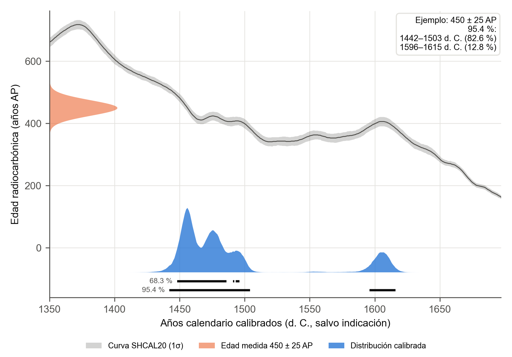

# wata · calibración de radiocarbono en español

**wata** («año» en quechua) calibra fechados de carbono 14 para arqueología,
con salidas listas para una tesis: rangos al 68.3 % y al 95.4 %, tablas CSV y
figuras a 300 ppp. Funciona sin conexión, en Python, y deja que cada
investigador elija la curva que corresponde a los Andes tropicales: SHCal20,
IntCal20 o una mezcla de ambas.

OxCal, el programa de referencia, no publica una versión nueva desde el 15 de
abril de 2021 (4.4.4). wata no pretende reemplazarlo: es una alternativa
abierta y verificable, pensada para quien investiga y escribe en español.



## Qué hace

- Calibración simple con SHCal20 (predeterminada), IntCal20 o una curva
  mixta con proporción e incertidumbre (`mixta:0.5:0.1`), con la fórmula de
  mezcla de OxCal.
- Rangos de máxima densidad (pueden ser varios tramos), mediana y media.
- Años en «d. C.» y «a. C.» sin año cero.
- Lotes desde un CSV y suma de probabilidades descriptiva.
- Simulación de fechados: cuánto recupera la calibración un año conocido.

## Validación

Reproduce los 11 fechados de Machu Picchu calibrados con OxCal 4.3.2 por
Ziółkowski et al. (2021): 20 de 21 rangos coinciden con una diferencia máxima
de 2 años. Se contrastó además con IOSACal en 616 rangos. Detalle en
[`04_resultados/02_validacion.md`](04_resultados/02_validacion.md).

## Instalación

Python 3.10 o superior.

```bash
python -m pip install -r requirements.txt
```

Las curvas ya están en `02_datos/curvas/`. Si faltan: `python -m wata curvas`.

## Uso

Desde la carpeta `01_codigo/`:

```bash
python -m wata calibrar 450 25
python -m wata calibrar 450 25 --figura fechado.png --nombre "Beta-123456"
python -m wata --curva mixta:0.5:0.1 calibrar 450 25
python -m wata --curva intcal20 lote ../02_datos/fechados/mis_fechados.csv --salida tabla.csv
python -m wata simular 1438 --sigma 20
```

Salida de la primera orden:

```text
450±25: 450 ± 25 AP · curva shcal20
  68.3 %: 1448–1485 d. C. (65.2 %); 1491 d. C. (0.9 %); 1493–1495 d. C. (2.9 %)
  95.4 %: 1442–1503 d. C. (82.6 %); 1596–1615 d. C. (12.8 %)
  mediana: 1473 d. C.
```

El CSV de un lote necesita las columnas `edad_ap` y `sigma`, y
opcionalmente `nombre` o `codigo_lab`.

Desde Python:

```python
from wata import calibrar
cal = calibrar(450, 25, "shcal20", nombre="Muestra 1")
for tramo in cal.hpd(0.954):
    print(tramo.texto())
```

## Caso de estudio: la cronología del Cusco

[`04_resultados/03_simulacion_cusco.md`](04_resultados/03_simulacion_cusco.md)
mide con simulaciones cuánta precisión da un fechado entre 1000 y 1600 d. C.
Entre 1400 y 1450 un fechado ± 25 AP queda acotado a unos 45 años; desde
1450, a 130–150. Con IntCal20 las fechas de época inka salen unos 30 años más
antiguas que con SHCal20.

## Cómo citar

Toda calibración debe citar la curva usada (Hogg et al., 2020, para SHCal20;
Reimer et al., 2020, para IntCal20). Las referencias completas y los SHA-256
están en [`02_datos/curvas/ORIGEN.md`](02_datos/curvas/ORIGEN.md).

## Pruebas

```bash
python -m pytest pruebas
```

## Estructura

| Carpeta | Contenido |
|---|---|
| `01_codigo/wata/` | el paquete: curvas, calibración, simulación, figuras y línea de órdenes |
| `01_codigo/estudio_cusco.py` | simulaciones del caso Cusco |
| `02_datos/curvas/` | SHCal20, IntCal20 (y las de 2013, solo para validar) |
| `02_datos/fechados/` | fechados del Cusco extraídos de la biblioteca, con su fuente |
| `04_resultados/` | viabilidad, validación, simulación y figuras |
| `pruebas/` | pruebas automáticas y contrastes con OxCal e IOSACal |

La descripción de la investigación está en [`00_LEEME.md`](00_LEEME.md).
